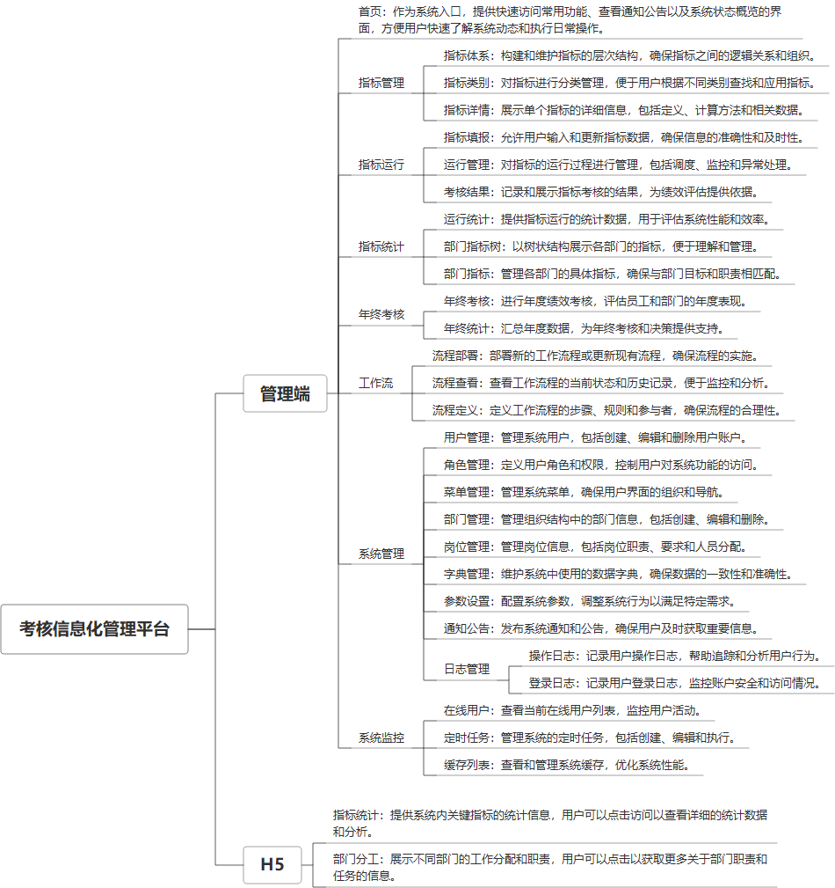

 

    
 

公司拥有上百套具有自主知识产权的软件系统，详情请查看码云首页或公司官网

 
<h1>考核信息化管理系统</h1>

<a href="https://www.haishi.net.cn/">公司官网</a> ｜ <a href="https://www.haishi.net.cn/">在线体验</a>

 

## 系统介绍

“考核信息化管理系统”是一套集指标体系管理、任务填报、考核结果统计及流程审批于一体的综合管理平台，旨在帮助组织实现考核管理的数字化和高效化。系统涵盖了指标体系的全生命周期管理，包括指标新增、修改、删除、导出等功能，支持指标填报任务的创建、审批、附件管理及年终考核结果统计，结合工作流审批功能，提供清晰的审批流程和调整时间记录，确保考核工作的透明性与规范性，同时通过数据统计与报表功能，为考核分析和决策提供数据支持，全面提升考核工作的效率和质量。
“考核信息化管理系统”是一套集指标体系管理、任务填报、考核结果统计及流程审批于一体的综合管理平台，旨在帮助组织实现考核管理的数字化和高效化。系统涵盖了指标体系的全生命周期管理，包括指标新增、修改、删除、导出等功能，支持指标填报任务的创建、审批、附件管理及年终考核结果统计，结合工作流审批功能，提供清晰的审批流程和调整时间记录，确保考核工作的透明性与规范性，同时通过数据统计与报表功能，为考核分析和决策提供数据支持，全面提升考核工作的效率和质量。
本项目名为考核信息化管理平台，旨在实现指标管理、指标运行监控、考核结果统计以及年终考核等功能的自动化和信息化。该平台适用于企业内部的绩效考核管理，涵盖了从指标体系搭建、指标数据填报到最终考核结果生成的完整流程。该系统通过指标统计、部门指标树等功能，提供多维度的数据分析，辅助管理决策。此外，系统还包含工作流管理模块，支持流程部署、查看和自定义，以满足不同考核流程的需求。本项目包含PC端和H5端两个终端。
- PC端：面向管理员和普通用户，提供全面的考核管理功能，包括指标管理、指标运行、指标统计、年终考核、工作流管理和系统管理等。
- H5端：面向移动端用户，提供精简的功能，主要包括指标统计和部门分工查看。
                

## 系统功能介绍

### 系统包含终端说明

管理端（WEB）、用户端（H5）

| 序号 | 模块 | 模块说明 |
| --- | --- | --- |
| 1 | ZF-EXAM-NZKH-MANAGE | 管理端 |
| 2 | ZF-EXAM-NZKH-H5 | H5端 |
| 3 | ZF-EXAM-NZKH | 未知类型 |

### 系统功能结构

### 系统功能说明

主要功能：
指标管理：
- 指标体系：构建多层级指标体系，明确考核标准。
- 指标类别：对指标进行分类管理，方便查找和维护。
- 指标详情：查看和编辑具体指标信息，包括指标名称、计算方式、权重等。
指标运行：
- 指标填报：员工或部门负责人进行指标数据的录入和提交。
- 运行管理：监控指标运行情况，及时发现和处理异常数据。
- 考核结果：生成考核结果报表，提供数据分析和绩效评估依据。
指标统计：
- 运行统计：对指标运行数据进行统计分析，展现整体绩效水平。
- 部门指标树：以树形结构展示部门的指标体系，方便查看和管理。
- 部门指标：查看部门的具体指标数据和完成情况。
年终考核：
- 年终考核：进行年度绩效考核，总结全年工作成果。
- 年终统计：对年度考核结果进行统计分析，评估整体绩效水平。
工作流：
- 流程部署：部署自定义的考核流程，满足不同需求。
- 流程查看：查看已部署的流程，监控流程运行状态。
- 流程定义：自定义考核流程，设置流程节点和审批规则。
系统管理：
- 用户管理：管理系统用户账号，分配权限和角色。
- 角色管理：管理系统角色，设置角色权限。
- 菜单管理：管理系统菜单，配置菜单权限。
- 部门管理：管理部门信息，维护部门层级关系。
H5端功能：
- 指标统计：查看关键指标的统计数据。
- 部门分工：查看部门的分工情况。

## 系统主要界面

## 系统技术说明

### 代码模块说明

| 序号 | 目录 | 目录说明 |
| --- | --- | --- |

### 系统技术选型

#### 开发语言/框架

JAVA（JDK1.8）
前端框架：VUE2
脚手架：RuoYi
系统结构：单体应用

#### 服务中间件

Nginx
Tomcat

#### 数据库

MySQL（5.7+）
Redis

#### 其他说明

无

## 系统演示/商用

请扫码添加客服微信获取演示地址和系统详细资料。

如果您想基于考核信息化管理系统进行商业化交付或定制开发服务，我们提供有偿的技术服务支持，合作模式不限，欢迎沟通！

公司官网地址： <a href="https://www.haishi.net.cn/">https://www.haishi.net.cn</a>

联系客服获取专业回答。

## 使用须知

1、 本项目商用必须获得版权所有者的授权。

2、 未经允许本项目代码不允许二次出售。

